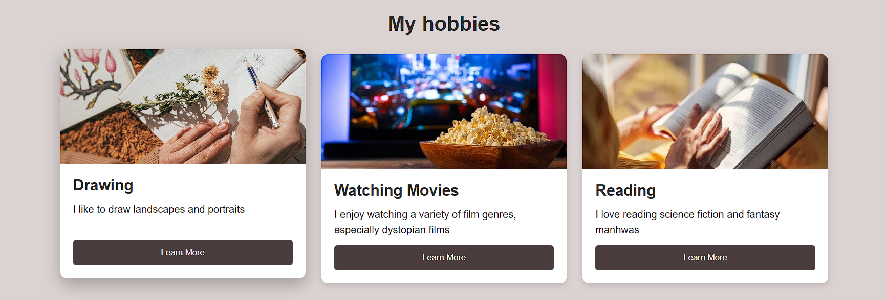
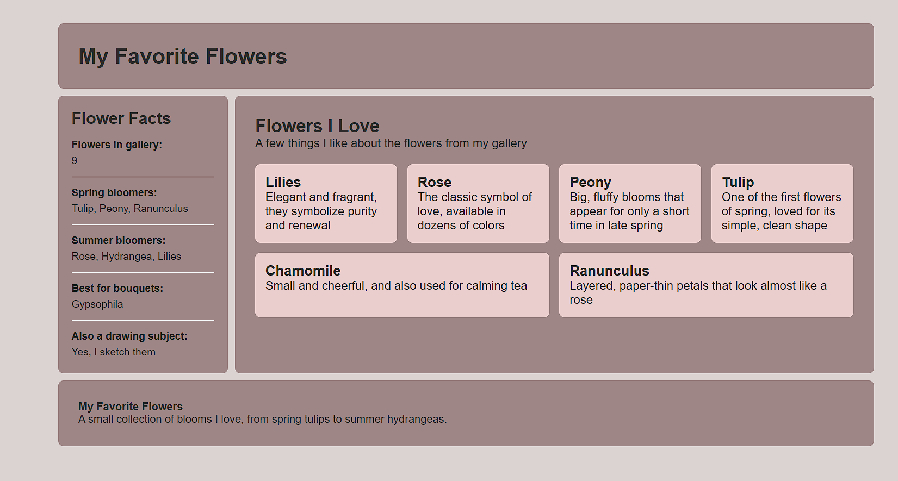
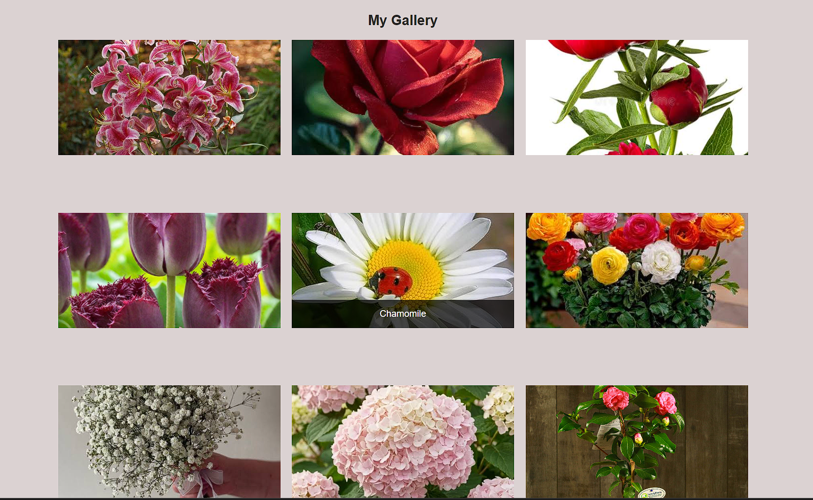
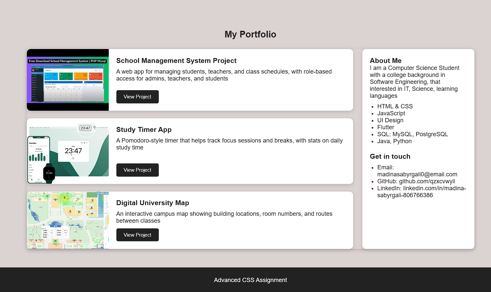

# Assignment #2 — Advanced CSS (Flexbox & Grid)

**Name:** Madina Sabyrgali
**Group:** IT-2503

---

## Part 1. Flexbox

### Task 0. Navigation Bar
Built a header with a circular logo on the left and a navigation list (Home, About, Contact) on the right. The header container uses `display: flex` with `justify-content: space-between` to push the logo and links apart, and `align-items: center` to vertically center both. Spacing between links is handled with `gap` on the flex container.

**Screenshot:** 

### Task 1. Card Row
Created a "My Hobbies" section with three cards (Drawing, Watching Movies, Reading), each containing an image, title, description, and a button. The `.cards` container is a flex row with `gap` for consistent spacing. Each `.card` is itself a flex column (`flex-direction: column`) with `flex: 1` on the content area so all cards stay equal height regardless of text length. A hover effect lifts the card (`translateY`) and adds a stronger shadow.

**Screenshot:** 

---

## Part 2. Grid System

### Task 2. Page Layout with Grid Areas
Built a page layout with header, sidebar, main content, and footer using `display: grid` and `grid-template-areas`. The header spans the full top row, the sidebar sits on the left, the main content fills the right, and the footer spans the full bottom row. Row height uses `auto` / `1fr` so the layout adapts to however much content the sidebar and main section actually contain, instead of a fixed pixel height. The main content area includes multiple info cards (laid out with Flexbox) covering different aspects of my hobbies, and the sidebar lists quick facts about me.

**Screenshot:** 

### Task 3. Image Gallery
Created a gallery of nine flower photos (lilies, rose, peony, tulip, chamomile, ranunculus, gypsophila, hydrangea, camellia) inside a grid container with three equal-width columns and consistent gaps. Each image has a caption overlay that fades in on hover using `opacity` transition and `position: absolute`, with the wrapping `.image` element set to `position: relative` so the caption anchors correctly to its own image.

**Screenshot:** 

---

## Part 3. Combining Flexbox & Grid

### Task 4. Portfolio Page
Added a portfolio section reusing the same flexbox header/footer from Task 0. The main portfolio area uses CSS Grid (`grid-template-columns: 1fr 300px`) to place a list of project cards on the left and an "About Me" info panel on the right. Each project card uses Flexbox internally to lay out the project image, title, description, and button in a row. The section includes three projects: a School Management System, a Study Timer App, and a Digital University Map.

**Screenshot:** 

---

## Summary of Work Process

I started from a base HTML/CSS template covering the navigation bar and card row, then worked through each remaining task in order:

1. Fixed a class name mismatch that was preventing the main content area from being placed into its grid area correctly.
2. Corrected an oversized `gap` value in the gallery grid and moved image-sizing rules from the wrapping div onto the actual `` elements so `object-fit: cover` would take effect.
3. Added `position: relative` to the gallery image wrappers so the hover captions anchor to the correct image.
4. Replaced placeholder gallery captions with the actual flower names.
5. Expanded the main content and sidebar areas with real content (info cards and quick facts) and switched the grid row heights from fixed pixel values to `auto`/`1fr` so the layout sizes itself to the content instead of leaving empty space.
6. Built the Task 4 portfolio section from scratch: a two-column grid (projects + info sidebar), with each project card using Flexbox to align its image, text, and button.

Throughout, I focused on keeping spacing and alignment consistent across all sections, matching the styling already established by the header/footer and card components.
